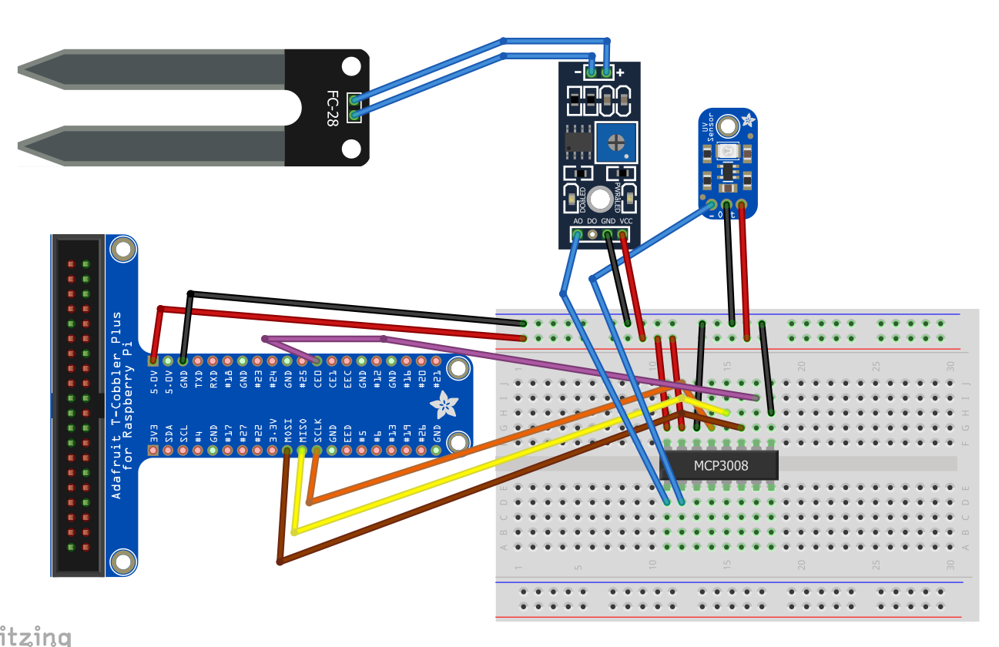

# PotPy
This project was conducted in order to complete the requirements for the 
COEN/ELEC 390 class at Concordia University, Montreal. 

PotPy is raspberry-pi based  gardening android-app for people who are to busy
to take care of their homeplants. It features automatic watering, plant condition monitoring and 
on demand watering. 

This project includes an Android application, a raspberry pi system connected to a plant and uses firebase to 
store the pertinent data. 

For information on the data path, check : [Our Draw.io files](docs/architectures)

Find [our Fritzing files](docs/fritzing)

## The Hardware 
### The Sensors 
#### Moisture Sensor

This analog moisture sensor reads value from 0 (wet) to 1023 (dry).  
#### UV light Sensor

The output voltage of the analog UV sensor changes with the intensity of the sun. 
According to the voltage, the output of the sensor gives us the UV index. 

A function is implemented to convert the read voltage into a uv index.
#### MPC3008 
This is used as an interface between the Analog pins of the sensors and the digital pins
of the Raspberry Pi 3B. To use the MPC3008, we need an SPI library which we get from py-spidev by [doceme](https://github.com/doceme/py-spidev) on Github.
#### Water Pump
We also have a submersible (DC Motor) water pump with a tube that will give water to our plant automatically. 

#### The connections are as follow

